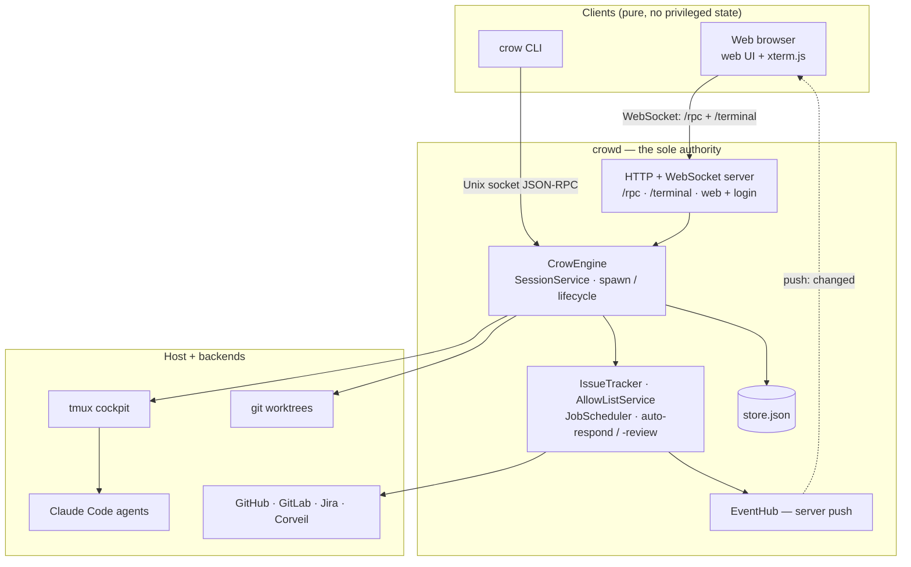

# Crow

Crow manages AI-powered development sessions. It runs as a background daemon (`crowd`) with a **browser-based UI**, orchestrating git worktrees, Claude Code instances, and GitHub/GitLab/Jira issue tracking. Each session pairs a git worktree, a tmux-backed Claude Code terminal (streamed to xterm.js in your browser), and ticket metadata — all tracked in a persistent store.

> **Note:** Crow began as a native macOS app. As of [ADR 0007](docs/adr/0007-crowd-sole-authority-clients-only.md) and [ADR 0008](docs/adr/0008-retire-the-macos-app.md), the desktop app has been **retired**: `crowd` is the sole authority and the web UI is the only client. The daemon still runs on a macOS host because it drives `git`, `tmux`, and Claude Code locally.

## Architecture at a glance



`crowd` is the single source of truth — the only store writer, the only spawner, and the owner of terminal + agent lifecycle. Every UI is a **pure client**: it subscribes to `crowd`'s state over the `/rpc` + `/terminal` WebSocket surface, sends JSON-RPC, and renders. Multiple clients (browser tabs, the `crow` CLI, any future UI) attach to one running system at once. Full detail in [docs/architecture.md](docs/architecture.md).

## Prerequisites

### System Requirements

- **macOS 14.0+** (Sonoma or later) — `crowd` runs `git`, `tmux`, and Claude Code on the host
- **Xcode** with Command Line Tools installed
- A modern **web browser** for the UI

### Build Dependencies

| Tool  | Version | Purpose                     | Install                  |
| ----- | ------- | --------------------------- | ------------------------ |
| Swift | 6.0+    | Compiler (ships with Xcode) | `xcode-select --install` |
| mise  | latest  | Task runner (optional)      | `brew install mise`      |

### Runtime Dependencies

| Tool     | Purpose                                                       | Install                                               |
| -------- | ------------------------------------------------------------- | ----------------------------------------------------- |
| `gh`     | GitHub CLI — issue tracking, PR status, project boards        | `brew install gh`                                     |
| `git`    | Worktree management                                           | Ships with Xcode CLT                                  |
| `claude` | Claude Code — AI coding assistant                             | [claude.ai/download](https://claude.ai/download)      |
| `tmux`   | Terminal backend for managed sessions (≥ 3.3)                 | `brew install tmux`                                   |
| `glab`   | GitLab CLI (optional, for GitLab repos)                       | `brew install glab`                                   |
| `acli`   | Atlassian CLI (optional, for Jira task tracking)              | [developer.atlassian.com/cloud/acli](https://developer.atlassian.com/cloud/acli/guides/install-acli/) |

## Quick Start

```bash
# 1. Clone
git clone https://github.com/radiusmethod/crow.git
cd crow

# 2. Build (produces the `crow` CLI and the `crowd` daemon)
make build

# 3. Authenticate GitHub CLI — the write `project` scope is required
gh auth login
gh auth refresh -s project,read:org,repo

# 4. Configure your development root + workspaces
.build/debug/crow setup

# 5. Run the daemon — it serves the web UI
.build/debug/crowd
```

`crowd` prints `HTTP/WS listening on http://127.0.0.1:8787` on startup — open that URL in your browser. The first screen guides you through any remaining setup.

For a **hot-reload dev loop** (web assets served live from source, rebuild-and-restart on Swift changes):

```bash
make crowd-dev        # serves at http://127.0.0.1:8787, prints the URL
```

> **Note:** The required GitHub scope is the **write** `project` scope — `read:project` is insufficient because Crow updates ticket status via the `updateProjectV2ItemFieldValue` GraphQL mutation. See [docs/getting-started.md](docs/getting-started.md#3-github-authentication) for details.

### Install (put `crow` + `crowd` on your PATH)

The Manager terminal and the `/crow-workspace` skill call bare `crow ...`, so a build you can only launch by full path will break those workflows. Install the binaries so they're invokable from anywhere:

```bash
make install                       # symlinks crow + crowd into ~/.local/bin
```

If `~/.local/bin` isn't already on your `PATH`, add this to `~/.zshrc` (then restart your shell):

```bash
export PATH="$HOME/.local/bin:$PATH"
```

Use a different directory with `BINDIR`, e.g. `make install BINDIR=/usr/local/bin`.

`make install` creates **symlinks** into `.build/debug/`, so a later `make build` updates them in place — no need to re-run it. Re-run `make install` only when you switch to a release build (`make build CONFIG=release && make install CONFIG=release`) or after `make clean` (which removes `.build/` and leaves the symlinks dangling until the next build). Remove the symlinks with `make uninstall`.

### Remote access

`crowd` binds `127.0.0.1:8787` by default, so it's reachable only from the machine it runs on. To reach it from another device, front it with an HTTPS reverse proxy (e.g. [`tailscale serve`](https://tailscale.com/kb/1242/tailscale-serve)) and set a **web password** under **Settings → Web Access**. Non-loopback requests are blocked until a password is set and the connection is HTTPS (CROW-593).

## Documentation

- [**Getting Started**](docs/getting-started.md) — Clone, build, authenticate, and run
- [**CLI Reference**](docs/cli-reference.md) — Every `crow` subcommand and its flags
- [**Architecture**](docs/architecture.md) — Packages, key components, data flow
- [**Configuration**](docs/configuration.md) — File locations, workspace config, directory layout, session lifecycle
- [**Automation**](docs/automation.md) — Auto-create, auto-respond, auto-complete, and the Settings → Automation tab
- [**Troubleshooting**](docs/troubleshooting.md) — Build and runtime errors

## Usage

### The Web UI

The left rail groups your work:

- **Tickets** — Assigned issues grouped by project board status (Backlog, Ready, In Progress, In Review, Done in last 24h). Click a status to filter.
- **Manager** — A persistent Claude Code terminal for orchestrating work. Use `/crow-workspace` here to create new sessions. Launches in `--permission-mode auto` by default so orchestration commands (`crow`, `gh`, `git`) run without per-call approval; opt out via Settings → Automation → Manager Terminal.
- **Active Sessions** — One per work context. Shows repo, branch, issue/PR badges with pipeline and review status.
- **Completed Sessions** — Sessions whose PRs have been merged or issues closed.

Right-click a session (or **long-press** / tap the **⋮** button on touch devices) for its actions — rename, delete, copy links, and more.

### Creating a Session

In the Manager tab, tell Claude Code what you want to work on:

```
/crow-workspace https://github.com/org/repo/issues/123
```

Or use natural language:

```
/crow-workspace "add authentication to the acme-api API"
```

This will:

1. Create a git worktree with a feature branch
2. Create a session with ticket metadata
3. Launch Claude Code in plan mode with the issue context
4. Auto-assign the issue and set its project status to "In Progress"

## Features

### Ticket Board

- Pipeline view showing issues by project board status
- Click a status to filter the list
- "Start Working" button creates a workspace directly from an issue
- Issues linked to active sessions show a navigation button

### Jira tasks + GitHub code (cross-backend workspaces)

Per [ADR 0005](docs/adr/0005-task-and-code-backend-protocols.md), a workspace's
**Task Backend** (where tickets live) is chosen independently of its **Code
Backend** (where code + PRs live). You can track work in **Jira** while keeping
code and pull requests on **GitHub** — the task side runs through `acli`, the PR
side still runs through `gh`.

**Prerequisite — authenticate `acli`:**

```bash
# Install: https://developer.atlassian.com/cloud/acli/guides/install-acli/
acli jira auth login
acli jira auth status   # should print "✓ Authenticated"
```

**Configure a Jira-task / GitHub-code workspace** (Settings → Workspaces → edit a
workspace):

- **Code Backend** → `GitHub` (code + PRs stay on GitHub).
- **Task Backend** → `Jira` (offered only when `acli` is installed + authenticated;
  an inline hint tells you the fix when it isn't).
- **Atlassian Site** (e.g. `acme.atlassian.net`) — used to build `…/browse/KEY` links.
- **Project Key** (e.g. `PROJ`) — default project for created tickets.
- **My-tickets JQL** (optional) — defaults to
  `assignee = currentUser() AND statusCategory != Done`.

Settings persist to the workspace entry (`~/.claude/workspace-repos.json` keys:
`taskProvider`, `jiraProjectKey`, `jiraJQL`, `jiraSite`). Existing GitHub/GitLab
workspaces are unaffected — when no Task Backend is set, it follows the Code
Backend (GitHub code ⇒ GitHub issues, as before).

### PR Status Tracking

- Pipeline checks (passing/failing/pending)
- Review status (approved/changes requested/needs review)
- Merge readiness (mergeable/conflicting/merged)
- Purple badge with checkmark for merged PRs

### Auto-Complete

- Sessions automatically move to "Completed" when their linked PR is merged or issue is closed
- Checked every 60 seconds during the issue polling cycle
- Requires positive evidence the session was worked, so an unrelated PR merge can't flip an idle session

### Automation Suite

Crow can drive a ticket from assignment to merged with minimal manual steps. Toggles live under **Settings → Automation**; full walkthrough in [docs/automation.md](docs/automation.md).

- **Auto-create workspace** when an issue assigned to you is labeled `crow:auto`
- **Auto-suggest opening a PR** if a session completes with no PR linked
- **Auto-start review sessions** for opted-in workspaces when a PR becomes reviewable
- **Auto-respond** to changes-requested reviews and failed CI checks (off by default)
- **Auto-merge** Crow-authored PRs labeled `crow:merge` via `gh pr merge --auto --squash` (off by default; only acts on PRs whose commits carry a `Crow-Session:` trailer matching a known session). Crow lazily creates the `crow:merge` label on first observation; to pre-seed it manually: `gh label create crow:merge --color 0E8A16 --description "Crow: enable auto-merge once mergeable"`

### Review Board

- Multi-select with batch Start Review
- Bulk delete sessions
- Filter projects out via `excludeReviewRepos`
- Quick action buttons on the session detail header (open PR, mark in review, copy branch)
- Move completed sessions back to active

### Terminals

- xterm.js terminal surface in the browser, streamed from tmux over a WebSocket (`/terminal`)
- tmux-backed managed terminals — each session is a tmux window on a shared server (the "cockpit"), so per-session shells stay alive across UI navigation and across browser reconnects. Requires `tmux ≥ 3.3` (`brew install tmux`); without it, managed terminals don't render. See [docs/architecture.md#terminal-backends](docs/architecture.md#terminal-backends).
- Rename tabs from the UI or via `crow rename-terminal`

### Orphan Recovery

- On startup, scans git worktrees across all repos
- Worktrees not tracked in the store are automatically recovered as sessions
- Fetches ticket metadata and PR links from GitHub for recovered sessions

### Safe Deletion

- Deleting a session on a protected branch (main, master, develop) only removes the session metadata — the repo folder and branch are preserved
- The delete confirmation dialog reflects this, showing "Remove Session" instead of "Delete Everything"

## Development

### Adding a New Package

1. Create the package under `Packages/`
2. Add it to the root `Package.swift` dependencies and target (or to a package that a root target already pulls in)
3. Import in the targets that need it

### Testing

```bash
make test     # or: swift test --package-path Packages/<name>, or: mise test
```

Tests use the [Swift Testing](https://developer.apple.com/documentation/testing/) framework (`@Test` macros). Test files live under `Packages/*/Tests/`.

## Contributing

We welcome contributions! See [CONTRIBUTING.md](CONTRIBUTING.md) for guidelines on reporting bugs, suggesting features, and submitting pull requests.

## License

Apache 2.0 — see [LICENSE](LICENSE) for details.
