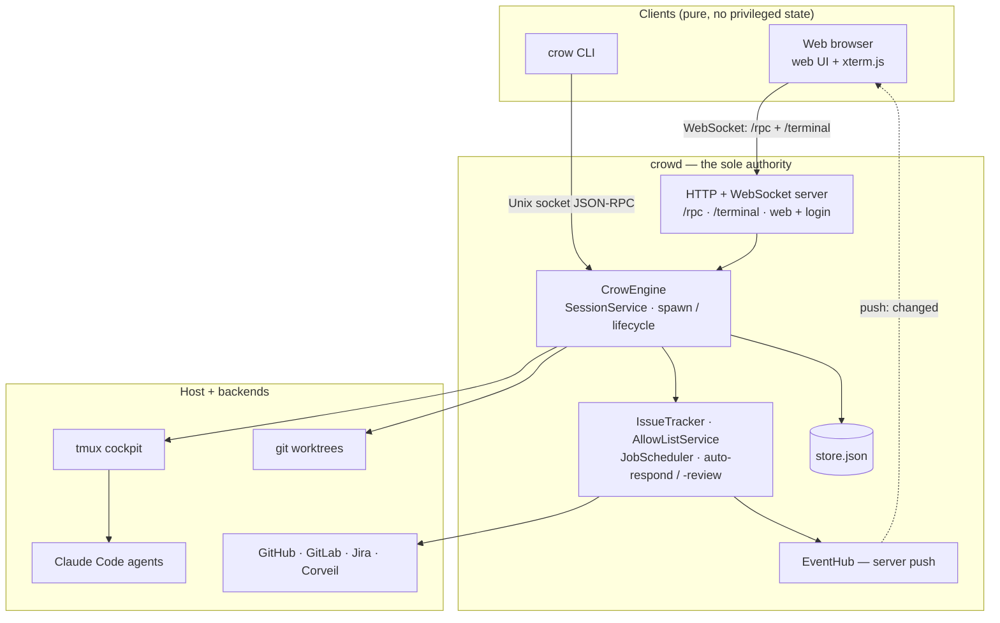

# Architecture

Crow coordinates AI-assisted development sessions. Each session is a git worktree + a coding-agent terminal (Claude Code by default; Cursor, OpenAI Codex, or OpenCode when installed) + ticket metadata, tracked in a persistent store. The `crowd` daemon is the **sole authority**: it owns the store, spawns workspaces (worktree + tmux window + agent), runs the background automations, and serves the web UI + a JSON-RPC surface. Every interface — the browser UI and the `crow` CLI — is a **pure client** that sends RPCs and renders pushed state. See [ADR 0009](adr/0009-crowd-sole-authority-clients-only.md) (crowd is the sole authority) and [ADR 0010](adr/0010-retire-the-macos-app.md) (the macOS app was retired).

## System diagram



## Repository Layout

```
crow/
├── Sources/
│   ├── crowd/                 # crowd daemon binary (thin entrypoint → CrowDaemon.run())
│   └── CrowCLI/               # crow CLI binary (thin entrypoint → CrowCommand.main())
├── Packages/                  # SwiftPM library packages
│   ├── CrowCore/                    # Data models, AppState (observable), store schema
│   ├── CrowEngine/                  # Host-agnostic engine: SessionService, IssueTracker,
│   │                                #   AutoRespondCoordinator, JobScheduler, EngineRouter,
│   │                                #   HostBridge seam (no AppKit)
│   ├── CrowDaemon/                  # crowd: HTTP/WS server, RPC handlers, web assets,
│   │                                #   web-access auth, terminal WebSocket
│   ├── CrowCLI/                     # CLI command definitions (CrowCommand + subcommands)
│   ├── CrowIPC/                     # Unix socket JSON-RPC protocol (SocketServer/SocketClient)
│   ├── CrowAutostart/               # Login-item installer (launchd LaunchAgent) for crowd
│   ├── CrowTerminal/                # tmux backend + terminal cockpit
│   ├── CrowGit/                     # Git operations
│   ├── CrowProvider/                # GitHub/GitLab/Jira/Corveil provider abstraction
│   ├── CrowPersistence/             # JSON store, config persistence
│   ├── CrowClaude / CrowCodex / CrowCursor / CrowOpenCode  # coding-agent adapters
│   └── CrowTelemetry/               # telemetry
├── scripts/                   # Build helpers (generate-build-info.sh, crowd-dev.sh)
└── skills/                    # Bundled Claude Code skills (crow-workspace, etc.)
```

> **History:** the AppKit app (`Sources/Crow`) and its SwiftUI package (`Packages/CrowUI`) were removed when the app was retired ([ADR 0010](adr/0010-retire-the-macos-app.md)). The engine had already been extracted into the host-agnostic `CrowEngine` package during the CROW-581 migration, so `crowd` runs the same session logic the app used to.

### About `Sources/CrowCLI` vs `Packages/CrowCLI`

There are two `CrowCLI` directories:

- **`Packages/CrowCLI/`** is a library package (`CrowCLILib`) that defines every subcommand as a `ParsableCommand` struct plus the `CrowCommand` root. This is where you add new commands or edit existing ones.
- **`Sources/CrowCLI/main.swift`** is a thin executable target that imports `CrowCLILib` and calls `CrowCommand.main()`. Keeping the command logic in a package lets tests in `Packages/CrowCLI/Tests/` exercise commands directly without building the executable. `Sources/crowd/main.swift` is the analogous thin entrypoint for the daemon.

## Key Components

| Component                  | Lives in                                               | Description                                                                                                       |
| -------------------------- | ------------------------------------------------------ | ----------------------------------------------------------------------------------------------------------------- |
| **CrowDaemon.run()**       | `Packages/CrowDaemon/.../CrowDaemon.swift`             | Boots the daemon: HTTP/WS server, Unix socket, board poll, automations, spawn engine. `crowd` is always the authority |
| **RPC handlers**           | `Packages/CrowDaemon/.../RPCHandlers.swift`            | The daemon's command router — every RPC (`new-session`, `list-tickets`, `create-manager`, config, …) runs locally against `AppState` + `JSONStore` |
| **HTTP/WebSocket server**  | `Packages/CrowDaemon/`                                 | Serves the web UI, xterm assets, `/rpc` (JSON-RPC + push), `/terminal` (byte stream), and web-access auth (`WebAuth*`, CROW-593) |
| **SessionService**         | `Packages/CrowEngine/.../SessionService.swift`         | CRUD for sessions/worktrees/terminals, spawn orchestration, terminal-readiness tracking, orphan recovery on startup |
| **IssueTracker**           | `Packages/CrowEngine/.../IssueTracker.swift`           | Polls providers every 60s for assigned issues, PR status, project board status; auto-completes merged sessions    |
| **AutoRespondCoordinator** | `Packages/CrowEngine/`                                 | Watches PR review / CI signals and types follow-up instructions into the linked Claude Code terminal              |
| **JobScheduler**           | `Packages/CrowEngine/`                                 | Runs scheduled jobs headlessly on the daemon's own SessionService                                                 |
| **EventHub**               | `Packages/CrowDaemon/`                                 | Fan-out hub that pushes `changed` nudges to every connected `/rpc` client so UIs re-fetch reactively              |
| **TmuxBackend / cockpit**  | `Packages/CrowTerminal/`                               | Owns the tmux server and the shared cockpit; each session terminal is a tmux window. `crowd` opens a private grouped view per browser connection |
| **SocketServer**           | `Packages/CrowIPC/`                                    | Unix socket server at `~/.local/share/crow/crow.sock` — receives JSON-RPC from the `crow` CLI                     |
| **AutostartService**       | `Packages/CrowAutostart/`                              | Registers `crowd` to start at login (launchd LaunchAgent on macOS). Shared by `crow autostart` and the daemon's local-only `/autostart` routes; the protocol leaves room for a systemd `--user` backend |
| **HostBridge**             | `Packages/CrowEngine/.../HostBridge.swift`             | Seam for host affordances (clipboard, open-in-editor, notifications). `crowd` uses a no-op default; the browser provides these itself where it can |
| **JSONStore**              | `Packages/CrowPersistence/`                            | NSLock-serialized JSON persistence for sessions, worktrees, links, terminals                                      |

## Coding-agent harnesses

Crow drives four coding agents ("harnesses") through one adapter protocol,
`CodingAgent`: **Claude Code**, **Cursor**, **OpenAI Codex**, and **OpenCode**.
Each harness declares its own capabilities (remote control, hook transport,
resume, review support, …) as protocol members; the engine branches on those,
never on a central `switch`. Harnesses register at daemon boot into
`AgentRegistry` — Claude Code always (and as the default), the others only when
their binary resolves on `PATH`.

The harnesses are **not at parity**: Claude Code is the reference implementation
and the others ship with deliberate, documented gaps. Two references cover this:

- **[Coding-agent harness capability matrix](agent-harness-matrix.md)** — the
  living harness × capability grid, with a why/notes column citing code and ADRs.
- **[ADR 0014](adr/0014-pluggable-coding-agent-adapter.md)** — the pluggable
  `CodingAgent` adapter architecture (and how it relates to the orthogonal
  task/code-provider axis in [ADR 0005](adr/0005-task-and-code-backend-protocols.md)).
- **[ADR 0015](adr/0015-harness-capability-tiers.md)** — why the non-Claude
  harnesses ship with capability gaps, and the version-pinned reasons to re-check.

Mid-session, a session can switch harnesses via `crow handoff-agent`
([ADR 0011](adr/0011-agent-handoff-preserves-session-not-chat.md)).

## Data Flow

### Opening a session terminal (web UI)

```
User selects a session in the browser
  → the page opens a WebSocket to /terminal
  → crowd opens a private grouped tmux view and starts `tmux attach-session`
  → PTY bytes stream to xterm.js (binary frames); keystrokes stream back
  → select-window control frames switch the view without disturbing other clients
```

### Creating a session from the Manager

```
User invokes /crow-workspace in the Manager terminal
  → Claude Code runs `crow` CLI commands over the Unix socket to crowd
  → crow new-session → crow add-worktree → crow new-terminal --managed
  → crowd's SessionService creates the session, registers the worktree,
    spawns a managed tmux window + agent
  → EventHub pushes `changed`; every open browser re-fetches and renders it
```

### Issue tracker polling

```
Every 60 seconds (crowd's board poll):
  → IssueTracker.fetchAssignedIssues (gh/glab/acli, per workspace)
  → IssueTracker.fetchPRStatus for linked PRs
  → fetchGitHubProjectStatuses (GraphQL, needs the write `project` scope)
  → Auto-complete sessions whose PR is merged or issue is closed
  → EventHub broadcast → clients re-fetch the boards
```

### Moving a ticket to "In Progress" / "In Review"

```
User starts a session via /crow-workspace (or triggers "Mark In Review")
  → IssueTracker builds a GraphQL query for the project Status field
  → Calls updateProjectV2ItemFieldValue mutation
  → Requires the write `project` scope — NOT `read:project`
  → On INSUFFICIENT_SCOPES, logs a hint to run `gh auth refresh -s project`
```

## Terminal rendering

Crow renders each session's terminal with [xterm.js](https://xtermjs.org) **in the browser**, streamed from the daemon over a `/terminal` WebSocket. On the daemon side each connection drives a native PTY whose child command is `tmux attach-session` against a private grouped view of the shared cockpit, so many browsers (and the Manager) can watch different windows of the same tmux server at once. The web assets (including the vendored xterm.js) live under `Packages/CrowDaemon/Sources/CrowDaemon/Resources/web/`.

## Terminal Backends

tmux is the only terminal backend. A headless PTY plus a tmux server, driven by `TmuxBackend`: each session terminal corresponds to a tmux window, and rendering is decoupled from the window so terminals can spin up before any client attaches. `crowd` opens a **private grouped tmux session per browser connection**, so each client has its own current-window without disturbing the others. Requires `tmux ≥ 3.3` on `PATH` (`brew install tmux`).

`SessionTerminal` carries a single-case `backend` discriminator (`.tmux`) so the persisted schema is stable and a future backend can be added without another migration. If tmux is missing or too old, `crowd` logs a warning and disables managed terminals (`/terminal` + terminal RPCs) until tmux is installed.

The original motivation and full alternative analysis are in [terminal-runtime-research.md](terminal-runtime-research.md).

## Settings

Settings are edited in the web UI's **Settings** modal and persist to `{devRoot}/.claude/config.json` via `CrowPersistence`. The daemon reads config fresh on each poll so edits take effect within one cycle. Tabs:

- **General** — devRoot, sidebar density, notifications, sounds.
- **Workspaces** — per-workspace provider, host, branch prefix, and per-workspace auto-review opt-in.
- **Automation** — every automation toggle in one place. See [automation.md](automation.md) for a per-toggle walkthrough.
- **Notifications** — global mute + per-event sound and (browser) notification config.
- **Web Access** — set or clear the web password that gates non-loopback access (CROW-593).

Credential **values** (Jira tokens, gateway secrets) are never editable from the browser: they are stripped on read and preserved on write, so a settings save from a client can't leak or clobber them.

## Review Board

The review board triages PRs queued for AI review:

- **Exclude list** — repos in `defaults.excludeReviewRepos` are filtered from the board, badge counts, and notifications. Wildcards supported.
- **Auto-start** — per-workspace toggle that auto-creates a review session when a PR becomes reviewable.
- **PR link reconciliation** — sessions whose hook events missed a PR open are reconciled against `gh pr list` on the next polling cycle.
- **Bulk delete** — selection mode that removes multiple sessions at once.
- **Multi-select + batch Start Review** — kick off several reviews in one action.
- **Filtering** — inline filter on the tickets list, mirrored across the review board.
- **Quick action buttons on the session detail header** — open PR, mark in review, copy branch.
- **Move to Active** — return a completed session to active without deleting it.
